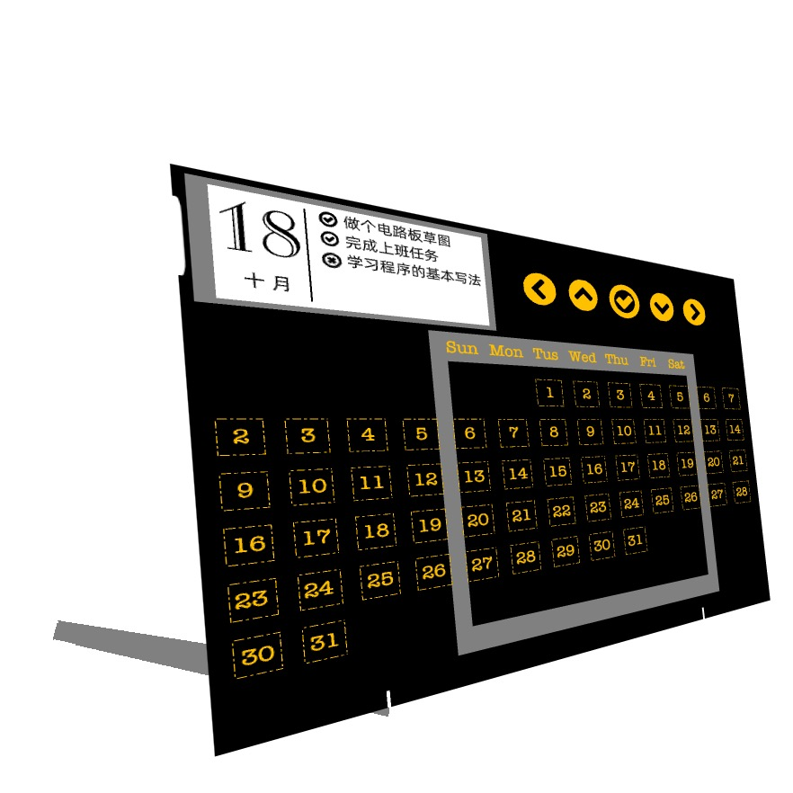
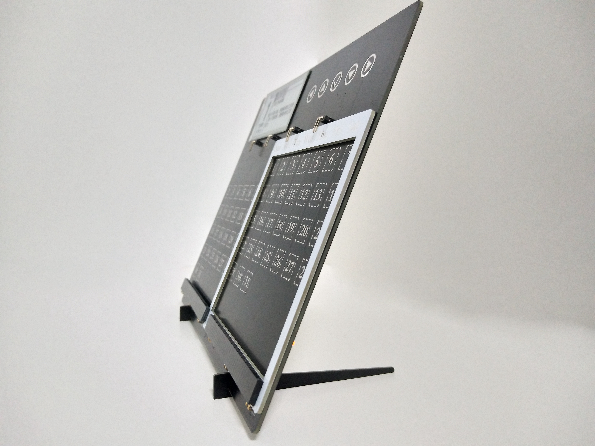
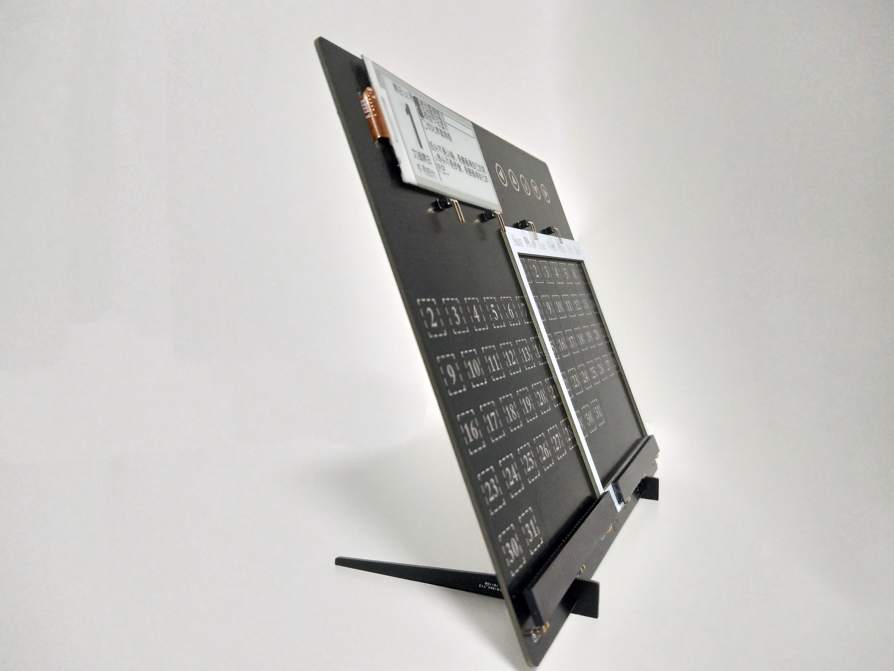
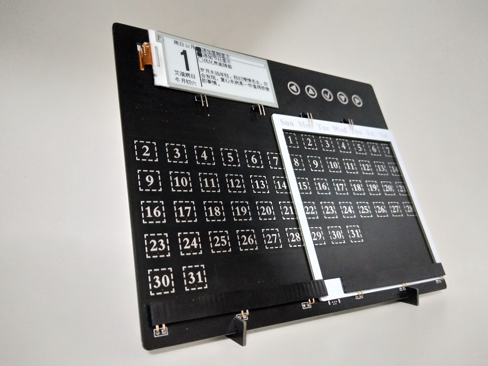
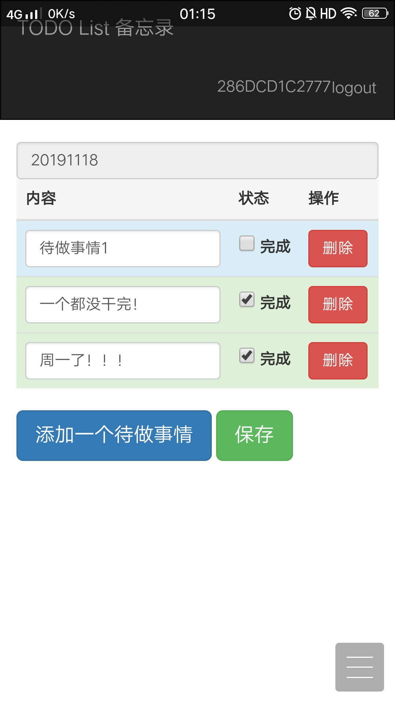
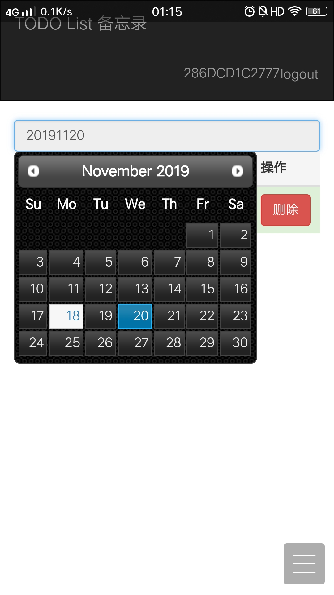
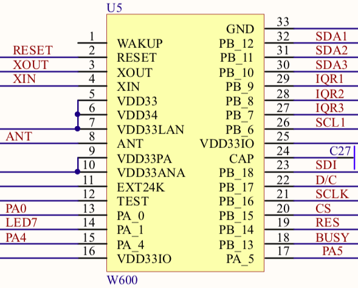
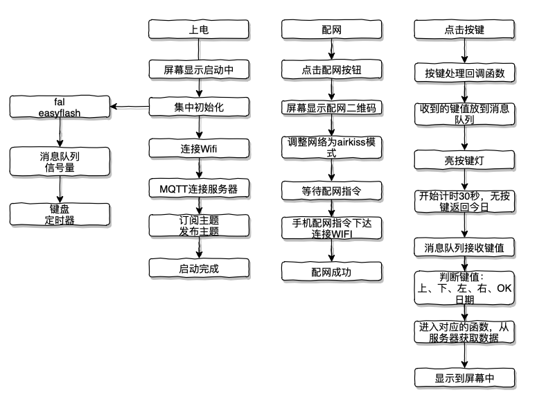

# 桌面台历

[前言](## 前言)
[一些图片](## 一些图片)
	[设计草图](### 设计草图)
	[实拍图](### 实拍图)
	[屏幕放大图](### 屏幕放大图)
	[Web端](### Web端)
[布局](## 布局)
	[整体](### 整体)
	[墨水屏](### 墨水屏)
[功能](## 功能)
[操作视频](## 操作视频)
[一点遗憾](## 一点遗憾)
[架构](## 架构)
	[业务处理服务](### 业务处理服务)
	[网页客户端](### 网页客户端)
[设备端详细介绍](## 设备端详细介绍)
	[硬件说明](### 硬件说明)
	[架构说明](### 架构说明)
		[applications](#### applications)
			[defines.h](##### defines.h #####)
			[init.c](##### init.c #####)
			[keyboard.c](##### keyboard.c #####)
		[逻辑流程图](#### 逻辑流程图)
	[软件包](### 软件包)
	[代码地址](### 代码地址)
[未来将要做的](## 未来将要做的)
	[设备端](### 设备端)
	[服务端](### 服务端)
	[客户端](### 客户端)
[结语](## 结语)

## 前言

​    这个桌面台历准备了很久，中间经历很多坎坷，终于阶段性实现了目标，非常欣慰。此处按下不表，先上图！

## 一些图片

### 设计草图





### 实拍图







### 屏幕放大图


### Web端





以上部分图是用我的手机拍摄的，个别地方拍花了，还请见谅！

## 布局

### 整体

- 左上角是一个墨水屏幕

- 右上角是5个触摸按键

- 下方是57个日期，每个都是触摸按键
- 白色方框是另外一块PCB电路板，上面有周一到周日的英文缩写
- 下方有两个空槽，有两条细长的PCB可以与之榫卯，形成一个夹角使电路板可以稳定立在桌面上
- PCB使用黑油喷锡工艺，正面几乎看不到电路
- 背面拥有芯片和电子元件

### 墨水屏

- 左上角是星期
- 紧邻右侧是月份
- 中间数字是日期
- 下方是纪念日期
- 最下方是农历
- 右侧上方是备忘事项，前面实心矩形表示完成
- 下方为每日一言，随机从网络上获取的一些文字

## 功能

- 墨水显示屏可以显示日期、星期、农历、节日
- 以及数条备忘事项，每条备忘事项前都有一个完成状态框
- 通过右上方的上下触摸按键移动到对应待做事项
- 点击确定可以标记为当前备忘的完成状态，再点击一次标记为未完成
- 有上角的左右触摸按键，点击可以查看前一天或后一天的备忘事项
- 点击下方月历每个日期，都可查看当前月份不同日期的备忘
- 可以通过WIFI联网
- 手机端或者电脑端可以通过网页同步相关备忘，可以随时更新和查看状态。

## 操作视频

[操作视频演示链接](https://www.bilibili.com/video/av78329356/)

​    视频是我用手机拍的，像素和清晰度有点渣，还请见谅。

## 一点遗憾

​    受制于时间工期的限制，这是第一块板子，主要是为了验证功能，所以并没有使用沉金工艺，所以，触摸按键的颜色都是银白色的，但到手发现效果也不错。

​    不过，下一版继续优化的话，肯定会比这一版更漂亮！

## 架构

整个桌面台历项目由三部分组成：

- 业务处理服务
- 网页客户端
- 设备端

因为前两个都在服务器端，所以此处简略一写，不再详述。

### 业务处理服务

​    设备通过MQTT传输数据，进入到业务处理服务中，并将对应的数据进行加工和存储。这部分是使用了Python和Mysql。

这部分实现的主要功能是：

- MQTT消息的监听与接收
- Topic的分级解析和转发
- 数据的存储

### 网页客户端

​    最开始考虑过多种方案，比如微信小程序、手机APP、网页。最后综合考虑，使用了当前的web方案，使用了Flask。用户通过网页登录，便可以添加修改备忘事项。

​    当前版本拥有的功能：

- 用户通过设备编号登陆
- 切换不同的日期查看备忘事项
- 添加备忘
- 修改备忘
- 删除备忘

## 设备端详细介绍

​    采用了集成WIFI的联盛德W600芯片，搭配国产物联网操作系统RT-Thread。不得不在这里夸赞一下RT-Thread，上手很简单，而且有着丰富的软件包可以使用，编译环境和Linux下的编译非常相似，给我非常熟悉的感觉。

​    设备的硬件方面，采用了一块PCB作为主面板，正面只有一块墨水屏作为显示区，并且吸收了传统台历的特点，使用一块可以移动的日历框划分区域，可以直观的看到每月的日期。PCB背面焊接了相关的元器件，并且搭配了电池，可以脱离电线的束缚，就像一款真正的纸版桌面台历。

### 硬件说明

​    W600芯片可用的GPIO有17路，当前已经都被我使用了，如下图：



​    因为bs8116a-3 的触摸芯片i2c地址无法更改，而我又使用了3路，只能使用多个GPIO口。为了缩减使用，我将三路的I2C_SCL并为一路，节约了两个GPIO。三路触摸芯片又各自占用了一路GPIO作为中断引脚。故，仅触摸芯片就使用了7路GPIO。

​    LED7则是触摸按键灯。

​    PA5、PA4则用于串口。

​    PA0用于配网按钮。

​    另外，墨水屏使用了SPI。

### 架构说明

```
desk_calendar/
├── Kconfig
├── README.md
├── SConscript
├── SConstruct
├── applications
│   ├── SConscript
│   ├── defines.h
│   ├── init.c
│   ├── keyboard.c
│   ├── logic.c
│   ├── main.c
│   ├── mqtt.c
│   ├── network.c
│   ├── qrcode_array.h
│   ├── screen.c
│   └── timer.c
├── makeimg.py
├── packages
│   ├── EasyFlash-v3.3.0
│   ├── SConscript
│   ├── airkissOpen-latest
│   ├── bs8116a-latest
│   │   ├── LICENSE
│   │   ├── README.md
│   │   ├── SConscript
│   │   ├── inc
│   │   ├── samples
│   │   └── src
│   ├── cJSON-v1.0.2
│   ├── fal-v0.3.0
│   ├── lunar_calendar-latest
│   │   ├── LICENSE
│   │   ├── README.md
│   │   ├── SConscript
│   │   ├── inc
│   │   ├── samples
│   │   └── src
│   ├── netutils-v1.1.0
│   ├── packages.dbsqlite
│   ├── pahomqtt-v1.1.0
│   ├── pkgs.json
│   ├── pkgs_error.json
│   └── u8g2-c-latest
├── ports
│   ├── SConscript
│   ├── easyflash
│   │   ├── SConscript
│   │   └── ef_fal_port.c
│   ├── fal
│   │   ├── SConscript
│   │   ├── fal_cfg.h
│   │   ├── fal_flash_port.c
│   │   └── fal_flash_sfud_port.c
│   └── wifi
│       ├── SConscript
│       ├── wifi_config.c
│       └── wifi_config.h
├── rtconfig.h
└── rtconfig.py

```

​    以上就是我项目文件夹的结构设置，其中软件包部分略有缩减。

#### applications

​    这里放置了我的主要代码，共11个文件，c文件8个，头文件2个，编译文件1个。

```
applications
├── SConscript      /* 编译文件 */
├── defines.h       /* 变量 函数声明 */
├── init.c          /* 初始化 */
├── keyboard.c      /* 键盘相关处理 */
├── logic.c         /* 逻辑处理 */
├── main.c          /* 主函数 */
├── mqtt.c          /* MQTT操作相关 */
├── network.c       /* 网络操作相关 */
├── qrcode_array.h  /* 配网二维码数组 */
├── screen.c        /* 屏幕操作相关 */
└── timer.c         /* 计时器 */
```

下面我随意挑选部分内容简单介绍一下：

##### defines.h #####

```c
#define MAX_TODO_SIZE  8
typedef struct {
    char content[64];
    short status;
} TODO;
typedef struct {
    char date[16];
    TODO todo_list[MAX_TODO_SIZE];
    char festival[64];
    char words[256];
} CALENDAR;
extern CALENDAR calendar_data;
```

​    此处定义了我传输数据的结构体，大部分数据都是存储在这个结构体中。

##### init.c #####

```c
/* 集中初始化 */
void init_all(void) {
    fal_init();
    easyflash_init();
    init_mq();
    init_sem();
    init_keyboard();
    hwtimer_init();
}
```

​    这个函数将各个部分放置到一起，按照顺序逐个初始化。

##### keyboard.c #####

```c
/* 按键触发调用函数 */
void got_key_callback(rt_uint8_t key_code) {
    if (REFRESH_END_FLAG == 1) {
        /* 发送消息到消息队列中 */
        int result = rt_mq_send(&mq, &key_code, 1);
        if (result != RT_EOK) {
            rt_kprintf("rt_mq_send ERR\n");
        }
        touch_led();
        start_timer(30);
        REFRESH_END_FLAG = 0;
    }
}

```

​    这里便是实现了检测到按键触发后的逻辑，将键值通过消息队列发送出去，并且启动按键提示灯和开始按键计时。

#### 逻辑流程图



​    大概的流程如上，主要分为上电，配网，以及点击按键。每个部分逻辑上都比较简单，就没有详细展开。

### 软件包

这里我使用到的软件包有9个，分别是：

 `EasyFlash-v3.3.0` 
 `airkissOpen-latest` 
 `bs8116a-latest` 
 `cJSON-v1.0.2` 
 `fal-v0.3.0` 
 `lunar_calendar-latest` 
 `netutils-v1.1.0` 
 `pahomqtt-v1.1.0` 
 `u8g2-c-latest` 

其中，我贡献的软件包有两个：

 `bs8116a-latest` 是 合泰触摸芯片的操作软件包 ；

 `lunar_calendar-latest` 是一个阳历日期转阴历日期的软件包；

这两个最开始是我写在项目代码当中，后来进行代码优化的时候，觉得可以重构出来，形成单独的软件包。于是用了一点时间重新改写了一下，已提交到了RT-Thread的Package代码仓库当中，相关资料欢迎到软件包仓库中查阅。

### 代码地址

 `bs8116a-latest` 代码地址：https://github.com/illusionlee/bs8116a.git 

 `lunar_calendar-latest`  代码地址：https://github.com/illusionlee/lunar_calendar.git 

项目代码地址：https://github.com/illusionlee/desk_calendar.git 

## 未来将要做的

​     这个版本的软件和硬件还有着很多不足，还有很多可以继续优化和改进的地方。未来即将要做的有：

### 设备端

- **滑框指示灯** 在最下面添加一排LED，对应滑框的位置亮起来，可以直观的告诉用户，滑框应该摆放在什么位置
- **按键反馈灯** 因为墨水屏的原因，会经常感觉没有点击到按键，所以需要加个触摸反馈
- **底部支架优化** 支架的作用不仅仅是用作支撑，还可以画成尺子，两根支架合成剪子，充分发挥办公室文具的作用
- **提示音** 可以使用蜂鸣片，在设定的时间进行提示，缩减查看屏幕的次数

### 服务端

- **架构优化** 当前自己搭建的服务器，比较简陋，需要重新设计

### 客户端

- **用户注册** 当前不允许用户自行注册，未来需要完善这部分功能
- **界面优化** 这块不专业，自己随便配了色，虽自我感觉良好，但只能认清现实，我不适合做UI设计师 哈哈
- ……

## 结语

​    这个桌面台历，在2018年年底就已经有一些构思，随着时间的推移，终于在2019年10月上旬正式下决心进行制作。中间遇到了很多困难，有无数个抓狂的时刻，但好在坚持了下来。

​    不知我利用了多少的业余时间，只记得很多个夜里，凌晨一两点我还在抓挠着头发，思考着BUG的原因。也不知多少个清晨，被闹钟吵闹多次才叫醒的我想过放弃。人生艰难，坚持不易。

​    感谢我的好友，帮我完成了硬件部分，若不是有他作为我坚强的后盾，我想我可能在这么短的时间完成这个台历。在这里谢谢他！

​    最后，如果你有什么好点子或者想法，欢迎分享给我。

